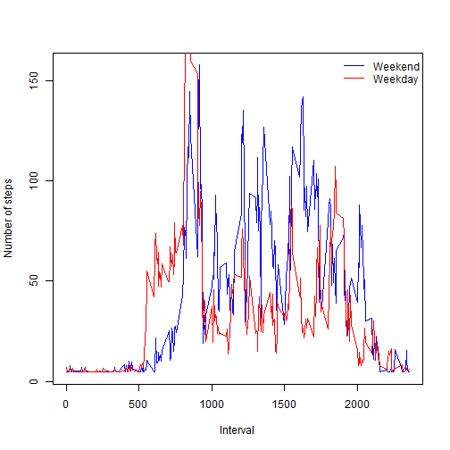

Reproducible Research - PA1
========================================================

##Loading and preprocessing the data

#1. Load the data and 2. Process/transform data (if necessary)


```r
library(knitr)
setwd("C:/Users/USER/Desktop/Coursera/Reproducible Research")
act_data <- read.csv("activity.csv")
```

--------------------------------------------------------
##What is mean total number of steps taken per day?

#1. Make a histogram of the total number of steps taken each day


```r
hist(act_data$steps)
```

 

#2. Calculate and report the mean and median total number of steps taken per day


```r
temp1 <- subset(act_data, act_data$steps != 'NA')
```

The mean is:


```r
mean(temp1$steps)
```

```
## [1] 37.38
```

The median is:


```r
median(temp1$steps)
```

```
## [1] 0
```

--------------------------------------------------------
##What is the average daily activity pattern

#1. Make a time series plot (i.e. type = "l") of the 5-minute interval (x-axis) and the average number of steps taken, averaged across all days (y-axis)


```r
temp2 <- aggregate(act_data$steps ~ act_data$interval, data = act_data, FUN = "mean")
plot(temp2,type = 'l')
```

 

#2 Which 5-minute interval, on average across all the days in the dataset, contains the maximum number 
#of steps?


```r
temp2[which.max(temp2[,2]),]
```

```
##     act_data$interval act_data$steps
## 104               835          206.2
```

--------------------------------------------------------
##Imputing missing values

#1. Calculate and report the total number of missing values in the dataset (i.e. the total number of 
#rows with NAs)


```r
nrow(subset(act_data, is.na(act_data)))
```

```
## [1] 2304
```

#2. Devise a strategy for filling in all of the missing values in the dataset. The strategy does not need to be sophisticated. For example, you could use the mean/median for that day, or the mean for that 5-minute interval, etc.

#NOTE - Strategy is to replace NA values with the mean we determined earlier - mean(temp1$steps)

#3. Create a new dataset that is equal to the original dataset but with the missing data filled in.


```r
act_data2 <- act_data
# temp1 had the non NA data stored from earlier, so we can use the mean from that
act_data2[is.na(act_data2)] <- mean(temp1$steps)
```

#4. Make a histogram of the total number of steps taken each day and Calculate and report the mean and 
#median total number of steps taken per day. Do these values differ from the estimates from the first part of the assignment? What is the impact of imputing missing data on the estimates of the total daily number of steps?


```r
hist(act_data2$steps)
```

 

#Mean from earlier with NAs removed


```r
mean(temp1$steps)
```

```
## [1] 37.38
```

#Mean with imputed data


```r
mean(act_data2$steps)
```

```
## [1] 37.38
```

#Since we backfilled the NA values with the mean across the non NA dataset the mean values are the same

#Median from earlier with NAs removed


```r
median(temp1$steps)
```

```
## [1] 0
```

#Median with imputed data


```r
median(act_data2$steps)
```

```
## [1] 0
```

#The median is still 0 - this is because there are a very large number of $steps values that are 0 

--------------------------------------------------------

##Are there differences in activity patterns between weekdays and weekends?

#1. Create a new factor variable in the dataset with two levels - "weekday" and "weekend" indicating 
#whether a given date is a weekday or weekend day.


```r
act_data2$day <- weekdays(as.Date(act_data2$date))
dayflag <- function(day) {
if(day == "Saturday"){
    "Weekend"
} else if(day == "Sunday"){
    "Weekend"
} else {
    "Weekday"
}
}
act_data2$dayflag <- as.factor(sapply(act_data2$day, dayflag))
```

#2. Make a panel plot containing a time series plot (i.e. type = "l") of the 5-minute interval (x-axis) 
#and the average number of steps taken, averaged across all weekday days or weekend days (y-axis). 

#NOTE - Overlaid the two plots on the same axis because it makes it easier to compare / visualize the differences in the Weekday / Weekday data


```r
act_data2_weekend <- subset(act_data2, act_data2$dayflag == "Weekend")
act_data2_weekday <- subset(act_data2, act_data2$dayflag == "Weekday")
temp3 <- aggregate(act_data2_weekend$steps ~ act_data2_weekend$interval, data = act_data2_weekend, FUN = "mean")
temp4 <- aggregate(act_data2_weekday$steps ~ act_data2_weekday$interval, data = act_data2_weekday, FUN = "mean")

par(mfrow=c(1,1))
plot(temp3,type = 'l', col="blue", xlab = "Interval", ylab = "Number of steps")
lines(temp4,type = 'l', col="red")
legend("topright", legend = c('Weekend', 'Weekday'),lwd = 1, bty = "n", col = c("blue", "red"))
```

 

#There are differences in activity between the weekdays/weekends.  For example, the plot shows that the weekdays tend to have more activity during the morning hours and less activity during work hours.
